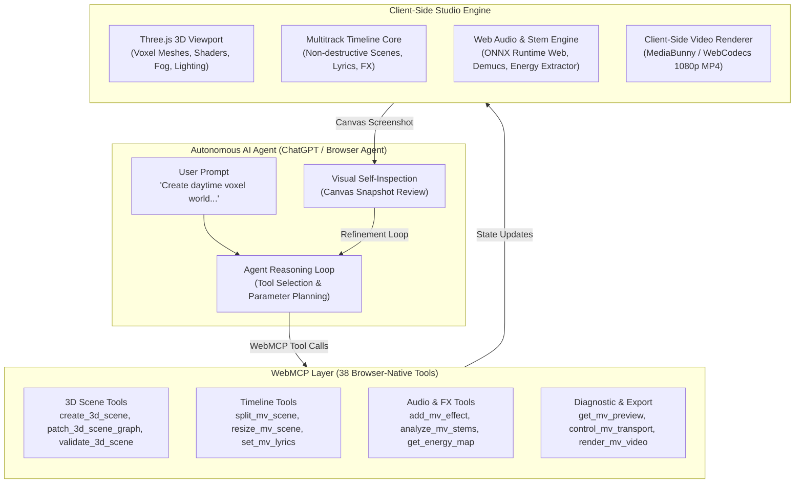

# Voivent MV Studio

> Agent-native 3D music video production suite powered by WebMCP (Web Model Context Protocol).  
> Direct, design, synchronize lyrics, and render cinematic music videos inside the browser with autonomous AI agents.

[](LICENSE)
[](https://studio.voivent.com)
[](https://openai.com/ja-JP/webmcp-challenge/)

---

## Overview

Voivent MV Studio is an open-source, client-side creative application built for the OpenAI WebMCP Challenge 2026.

By exposing 38 browser-native tools through the Web Model Context Protocol (WebMCP), autonomous AI agents (such as ChatGPT, Claude, Gemini, or local models) can directly interface with:

- **Procedural 3D World Engine**: Real-time voxel terrain generation, orbital rings, procedural lighting, fog, and dynamic cameras using Three.js, WebGPU, and WebGL.
- **Multitrack Timeline**: Arbitrary multi-scene splitting (intro, verses, chorus, drops, narrative chapters), non-destructive clip editing, keyframe interpolation, and dynamic scene transitions.
- **Lyric Intelligence & Alignment**: Automatic lyric placement, multi-language translation, phoneme analysis, and safe-zone enforcement.
- **Audio-Reactive Signals & AI Stems**: Web Audio API beat detection, on-device AI stem separation accelerated by WebGPU (ONNX Runtime Web), and dynamic energy pulsing.
- **Visual Feedback Loop (`get_mv_preview`)**: The agent captures real-time canvas snapshots, visually inspects composition and lighting, and self-refines without human intervention.

Everything executes 100% client-side in the browser with zero backend infrastructure.

---

## Live Demo

- **Web Application**: [https://studio.voivent.com](https://studio.voivent.com)
- **Demo Video**: 2-minute 35-second walkthrough demonstrating autonomous 3D world creation, lyric synchronization, and cinematic time-of-day multi-scene direction.

---

## Architecture & Data Flow



---

## WebMCP Tool Interface (38 Tools)

### 1. 3D Scene Graph & Procedural Worlds
- `list_3d_capabilities`: Query supported procedural primitives, materials, and lighting features.
- `create_3d_scene` / `create_3d_mv_scene`: Generate complete 3D procedural scenes from structured JSON definitions.
- `validate_3d_scene_graph`: Perform schema and semantic validation on 3D node graphs.
- `patch_3d_scene_graph` / `update_3d_scene`: Incrementally add or modify meshes, orbital rings, fog, and light sources.
- `get_3d_scene_diagnostics`: Inspect object hierarchies, bounding volumes, and camera configurations.

### 2. Timeline & Scene Direction
- `split_mv_scene`: Split a scene at specific timestamps into continuous time-of-day chapters.
- `resize_mv_scene`: Adjust start times and durations across the multitrack timeline.
- `delete_mv_scene` / `select_mv_scene`: Manage and switch active editing scenes.
- `validate_mv_timeline`: Verify zero-gap and zero-overlap timeline consistency.

### 3. Lyric Synchronization & Styling
- `set_mv_lyrics`: Update, translate, and align lyric phrases with exact start/duration timings.
- `set_mv_lyric_style`: Customize typography, font colors, glow shaders, and safe-zone anchors.

### 4. Audio Analysis & Visual Effects
- `analyze_mv_stems`: Extract vocal, drum, bass, and instrumental energy envelopes in real-time.
- `get_mv_stem_map` / `get_energy_map`: Retrieve time-series peak and frequency energy arrays.
- `add_mv_effect` / `update_mv_effect`: Apply beat-synchronized pulse, glow, distortion, or aerial drift effects.

### 5. Visual Feedback & Transport
- `get_mv_preview`: Capture real-time canvas screenshots and return Base64 image data to the AI agent for visual self-inspection.
- `control_mv_transport`: Play, pause, seek, and loop timeline playback.
- `render_mv_video`: Render and download final 1080p MP4 videos entirely inside the browser.

---

## Quick Start

### Prerequisites
- Node.js 18+
- npm / pnpm / yarn

### Installation
```bash
# Clone the repository
git clone https://github.com/DISMUS333/voivent-mv-studio.git
cd voivent-mv-studio

# Install dependencies
npm install

# Start local development server
npm run dev
```

Open [http://localhost:5173](http://localhost:5173) in your browser.

---

## Running Tests

```bash
# Run unit tests
npm test
```

---

## Project Structure

```text
voivent-mv-studio/
├── public/                 # Static assets, demo audio, and audio models
├── src/
│   ├── components/
│   │   ├── mv/             # 3D Canvas, WebMCP tools, Timeline, Effects
│   │   │   ├── webMcpTools.ts      # 38 WebMCP tool declarations & schemas
│   │   │   ├── mv3dVoxelRuntime.ts # Three.js procedural voxel world
│   │   │   ├── SceneTimeline.tsx   # Multitrack timeline editor
│   │   │   └── stemAnalysis/       # ONNX Runtime Web stem separation
│   │   └── Icons.tsx       # Vector SVG icon system
│   ├── web/                # Web engine bootstrap & WebCodecs video export
│   └── i18n/               # Multilingual localization dictionaries
├── worker/                 # Cloudflare Workers static & API edge handler
├── package.json            # Open-source dependency manifest
└── vite.config.ts          # Vite build configuration
```

---

## Acknowledgements

Voivent MV Studio is made possible by these incredible open-source projects:

- [Three.js](https://threejs.org/) — Procedural 3D scene graphs and WebGPU/WebGL rendering
- [Phaser](https://phaser.io/) — 2D canvas visuals and particle pipelines
- [ONNX Runtime Web](https://onnxruntime.ai/) — On-device AI inference with WebGPU acceleration
- [Demucs](https://github.com/facebookresearch/demucs) — State-of-the-art music source separation architecture
- [MediaBunny](https://github.com/Vanilagy/mediabunny) — Fast in-browser MP4 container muxing and WebCodecs export
- [React](https://react.dev/) & [Vite](https://vitejs.dev/) — Reactive frontend architecture and fast bundling

---

## License

This project is licensed under the [MIT License](LICENSE).
